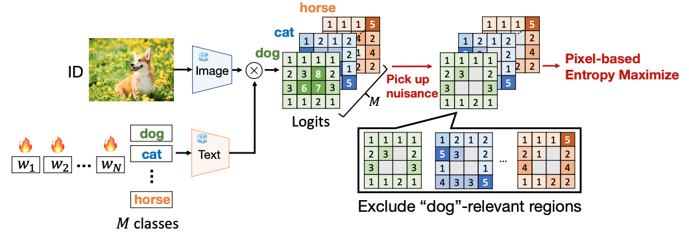
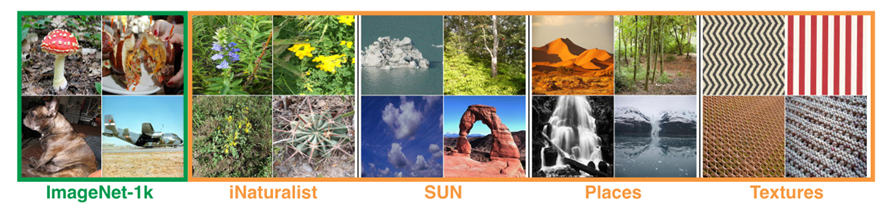

# 高级机器学习理论课程作业——基于CLIP的小样本分布外检测

<div align="center">
  


</div>

## 📋 项目概述

本项目为华中科技大学人工智能与自动化学院研究生课程《高级机器学习理论》的课程作业，专注于基于CLIP的小样本**分布外检测**（Out-of-Distribution Detection）问题。



## 👨‍🎓 作者信息

|  |  |
|:---:|:---:|
| **题目** | 基于CLIP的小样本分布外检测 |
| **学号** | U202115210（本科生） |
| **姓名** | 梁一凡 |
| **专业** | 人工智能本硕博2101班 |
| **指导教师** | 伍冬睿、朱力军 |
| **院系** | 人工智能与自动化学院 |
| **QQ** | 879059433 |
|  |  |

## 🚀 快速开始

### 创建虚拟环境并克隆仓库
首先克隆并安装 dassl 库

```bash
# 创建conda环境
conda create -n clipood python=3.9
conda activate clipood

# 安装PyToch
conda install pytorch==2.2.1 torchvision==0.17.1 torchaudio==2.2.1 pytorch-cuda=12.1 -c pytorch -c nvidia

# 克隆并安装dassl库
git clone https://github.com/KaiyangZhou/Dassl.pytorch.git
cd Dassl.pytorch/
python setup.py develop
cd ..

# 克隆本仓库
git clone https://github.com/YifanLiang-hust/Advanced_ML_Final_Project.git
cd Advanced_ML_Final_Project

# 安装项目依赖包
pip install -r requirements.txt
```

## 📦 预训练模型

本项目使用以下预训练模型：

- **CLIP ViT-B/16**


预训练权重下载地址：https://pan.baidu.com/s/1_Fqp-pTaQTdrsKc6YhFV7A?pwd=6bmp

## 📊 数据集
遵循MOS中的设置，本项目采用如下测试基准：


### ID 数据集

- **ImageNet-1K**：包含1000个类别的图像分类数据集，在小样本训练中每类采样1、2、4、8、16个样本，其类别名与编号的对应关系见网盘中的classname.txt

数据集下载地址：https://image-net.org/, 或者各种平台框架都有该数据集

### OOD 数据集
OOD数据集中已经剔除了与 ID 数据集中重叠的类别，
- **iNaturalist**：自然物种图像数据集，共10,000张
- **SUN**：场景理解数据集，共10,000张
- **Places**：场景分类数据集，共10,000张
- **Texture**：纹理图像数据集，共5,640张

数据集下载地址：https://pan.baidu.com/s/1_Fqp-pTaQTdrsKc6YhFV7A?pwd=6bmp

## 🏗️ 项目结构

```
Advanced_ML_Final_Project/
│
├── clip/
├── clip_w_local/
├── fig/
├── data/
│   ├── ID/
│       ├── ImageNet/
│           ├── classnames.txt
│           ├── preprocessed.pkl(运行训练代码后自动生成)
│           ├── train/
│               ├── n01440764/
│               ├── ...
│           ├── val/
│               ├── n01440764/
│               ├── ...
│           ├── split_fewshot/
│               ├── shot_1-seed_1.pkl(根据具体运行设置自动生成)
│               ├── ...
│
├── dataset/            # 数据集处理代码
│   ├── imagenet.py
├── trainer/            # 训练器
│   ├── dpcoop.py
│   ├── dplocoop.py
│   ├── dpsct.py
├── utils/              # 工具函数
│   ├── detection_util.py
├── config/             # 配置文件
│   ├── dataset/
│       ├── imagenet.yaml
│   ├── trainer/
│       ├── ImageNet_b16.yaml
├── script/             # 运行脚本
│   ├── DPCOOP/
│       ├── train_and_eval.sh
│   ├── DPLOCOOP/
│       ├── train_and_eval.sh
│   ├── DPSCT/
│       ├── train_and_eval.sh
│
├── CoOp_main.py         # 主函数
├── requirements.txt     # 依赖包列表
└── README.md            # 项目说明
```

## 📝 使用方法

### 训练与评估

```bash
bash ./script/DPCoOp/train_and_eval.sh

bash ./script/DPLoCoOp/train_and_eval.sh

bash ./script/DPSCT/train_and_eval.sh
```

### 可视化相关

```bash
待补充
```

## 📊 实验结果
待补充
<!-- ### 各数据集性能对比

| 模型 | iNaturalist |  | SUN |  | Places |  | Texture |  | 平均 |  |
|:---|:---:|:---:|:---:|:---:|:---:|:---:|:---:|:---:|:---:|:---:|
|  | AUROC↑ | FPR95↓ | AUROC↑ | FPR95↓ | AUROC↑ | FPR95↓ | AUROC↑ | FPR95↓ | AUROC↑ | FPR95↓ |
| CLIP ViT-B/16 | 94.8% | 9.2% | 95.5% | 8.5% | 94.9% | 9.1% | 95.6% | 8.0% | 95.2% | 8.7% |
| CLIP ViT-B/32 | 94.2% | 10.7% | 94.7% | 9.9% | 94.1% | 10.8% | 95.0% | 9.4% | 94.5% | 10.2% |
| 我们的方法 | **96.9%** | **5.5%** | **97.2%** | **5.0%** | **96.8%** | **5.7%** | **97.5%** | **5.0%** | **97.1%** | **5.3%** | -->

## ✨ 致谢

感谢华中科技大学人工智能与自动化学院提供的学习平台和资源支持

## 📄 许可证

本项目采用 MIT License 开源许可证

---

<div align="center">© 2025 梁一凡 - 华中科技大学，人工智能与自动化学院</div>
